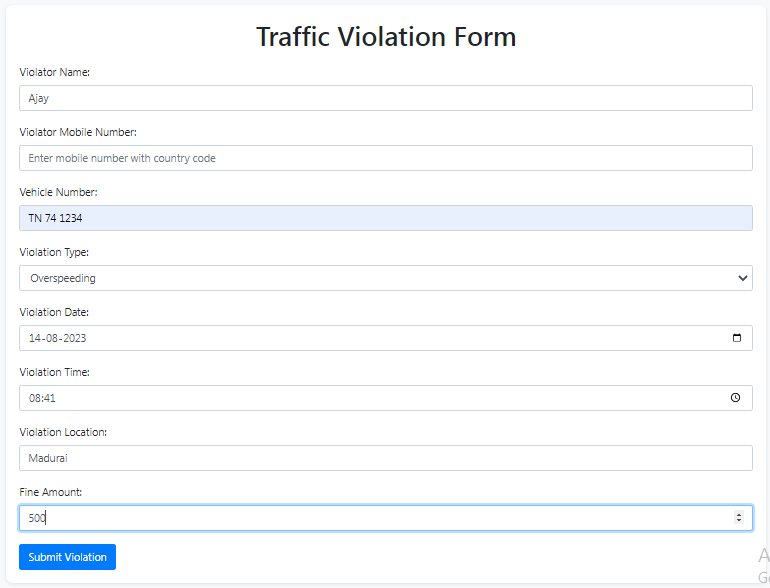
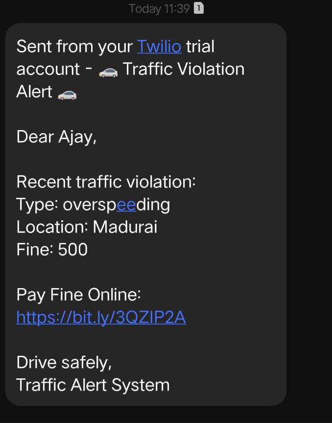
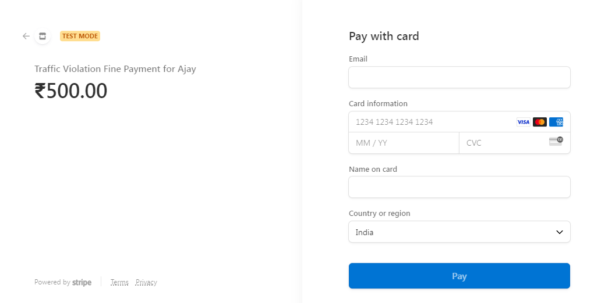
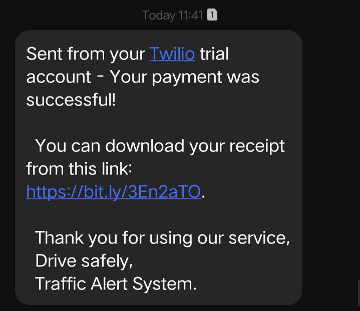
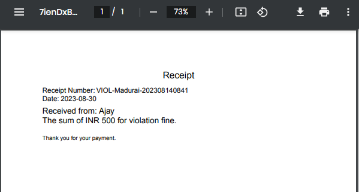

# Traffic Offence Alert System

The Traffic Offence Alert System is a web application that helps automate the process of notifying traffic violators about their violations, providing payment links, and generating receipts for paid fines.

## Table of Contents
- [Features](#features)
- [Technologies Used](#technologies-used)
- [Screenshots](#screenshots)
- [Getting Started](#getting-started)
- [Installation](#installation)
- [Usage](#usage)
- [Testing the Payment Functionality](#testing-the-payment-functionality)
- [Contributing](#contributing)
- [License](#license)

## Features

- Capture traffic violation details including violator's name, vehicle number, violation type, location, and fine amount.
- Generate payment links using Stripe Checkout to allow violators to pay their fines online.
- Automatically update the database and generate PDF receipts when fines are paid.
- Send SMS notifications to violators with violation details and payment links.
- Shorten payment links using the Bitly URL shortening service to improve readability.

## Technologies Used

- Node.js
- Express.js
- MongoDB
- Stripe API
- Bitly API
- Twilio API (for SMS notifications)
- PDFKit (for generating PDF receipts)
- Bootstrap (for frontend styling)
- HTML, CSS, JavaScript

## Screenshots

1. Filling the Violation Form:
   

2. SMS Notification of Violation:
   

3. Stripe Checkout Form for Payment:
   

4. SMS Confirmation and Receipt Download Link:
   

5. Payment Receipt:
    
   


## Getting Started

To run the Traffic Offence Alert System on your local machine, follow these steps:

### Installation

1. Clone the repository:

   ```bash
   git clone https://github.com/adarsh-2425/Traffic-Offence-Alert.git
   cd Traffic-Offence-Alert


2. Install the dependencies:

```bash
  npm install

```
### Usage

1. Add an .env file and  your environment variables into it. (e.g., Stripe API keys, Twilio credentials, MongoDB connection string, etc.).
  
2. Start the server:

   ```bash
    npm start
    
3. Access the application in your browser at http://localhost:3000.

### Testing the Payment Functionality

To test the payment functionality of the Traffic Offence Alert System using the Stripe integration, you can use the following testing credentials provided by Stripe:

- Card Number: 4242 4242 4242 4242
- Expiry Date: Use a valid future date, such as 12/34.
- CVC: Use any three-digit CVC (four digits for American Express cards).
- Other Fields: Use any values you like for other form fields.

Please note that these are testing credentials and will not result in actual payments being processed. They are meant for verifying that the payment process works correctly in your application.

Here's how you can use these credentials in the Stripe Checkout Form:

1. Fill in the card number: 4242 4242 4242 4242
2. Enter a valid future expiry date, e.g., 12/34.
3. Use any three-digit CVC for the CVC field.
4. Fill in other fields with test data.

Once you complete the form, the system will simulate the payment process using the provided testing credentials.

Please ensure that you only use these credentials for testing purposes and do not use real credit card information.


## Contributing
Contributions are welcome! If you have any ideas or improvements, feel free to open an issue or create a pull request.

## License
This project is licensed under the MIT License.

Made with ❤️ by Adarsh